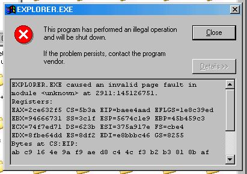



## Fake GPF Dialog

### Description

This is a stunningly realistic Illegal Operation dialog recreation. It will read all of the running processes into an array and choose a random process for the title. Also generates fake hex code for the registers and stack dump. *Every* line of code is commented, besides the Private Sub...End Sub lines. Most, if not all, of the API stuff I found on PSC (thanks guys!). Have fun!
 
### More Info
 
A fake GPF dialog!

None whatsoever.

             |
---                |---
**Submitted On**   |2002-07-22 15:16:38
**By**             |[Nathanael B](https://github.com/Planet-Source-Code/PSCIndex/blob/master/ByAuthor/nathanael-b.md)
**Level**          |Intermediate
**User Rating**    |4.5 (18 globes from 4 users)
**Compatibility**  |VB 6\.0
**Category**       |[Jokes/ Humor](https://github.com/Planet-Source-Code/PSCIndex/blob/master/ByCategory/jokes-humor__1-40.md)
**World**          |[Visual Basic](https://github.com/Planet-Source-Code/PSCIndex/blob/master/ByWorld/visual-basic.md)
**Archive File**   |[Fake\_GPF\_D1093067222002\.zip](https://github.com/Planet-Source-Code/nathanael-b-fake-gpf-dialog__1-37167/archive/master.zip)

### API Declarations

Plenty, in the zip.

